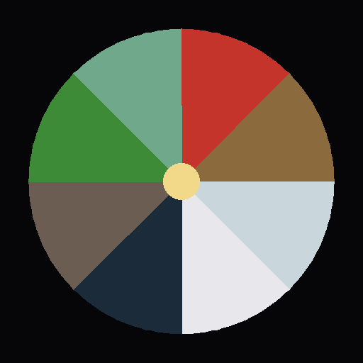

 Bagua Theremin — The Eight Trigrams, WebAR

A WebAR theremin: a real 3D bagua mirror (八卦鏡) floats over your camera feed. Your right hand's position on it picks colour and pitch, continuously — no fixed notes, just glide. Your left hand's height sets volume, the way a real theremin has separate pitch and volume antennas.

**Try it:** [binyoun.github.io/bagua-theremin](https://binyoun.github.io/bagua-theremin/)

## Concept

Eight trigrams, arranged in their traditional Later Heaven compass positions (South at the top, per Chinese diagram convention, not a literal compass): Li/Fire/red at top, then clockwise through Kun/Earth, Dui/Metal, Qian/Heaven, Kan/Water, Gen/Mountain, Zhen/Thunder, Xun/Wind. Modeled after a real bagua mirror: a reflective mirrored centre plate ringed by eight bevelled panels, each carrying its trigram's actual line pattern (solid = yang, broken = yin) as raised, embossed bars — not a flat drawn glyph, and not a decorative Unicode character (font coverage for the real hexagram glyphs proved unreliable in testing).

The disc is symbolic and discrete — eight distinct panels, each a real trigram — but the pitch a hand's angle produces is fully continuous across the whole circle. A theremin has no frets; moving through a panel means gliding through its pitch *range*, not landing on one fixed note. The disc also slowly self-rotates around its own face-normal axis, like a mounted mirror slowly turning; the interaction compensates for that rotation every frame, so a given screen position always resolves to whichever trigram is actually there right now.

**Why it's monophonic, and how it still harmonizes.** A true theremin split means one hand produces pitch and the other only shapes loudness — there's no second hand free to hold a second note. Instead, a quiet drone always sounds exactly one octave below the lead voice. This isn't approximate: the disc's full circle spans exactly two octaves, so the point diametrically opposite the lead pitch is always exactly one octave away — a guaranteed-consonant relationship by construction, not a coincidence of tuning.

This is a companion piece to **Tứ Bình**, which uses the painting-as-graphic-score catch-and-hold model instead — see the vault for how the two relate.

## How it works

- **HandTracker.js**: MediaPipe HandLandmarker, up to two hands, reports position and a stable per-hand identity (MediaPipe's own Left/Right label). No gesture/openness tracking — this piece is pure continuous position, not catch-and-hold.
- **BaguaDisc.js**: the Three.js scene — camera passthrough behind a transparent WebGL canvas, PMREM/RoomEnvironment lighting, ACES tone mapping (same pattern as this year's other WebAR pieces). Builds the disc procedurally: `ExtrudeGeometry` bevelled wedge panels with per-element PBR materials (metalness/roughness varied — metallic Qian/Dui, matte Kun/Gen, glossy Kan/Li), a `MeshPhysicalMaterial` mirror centre with clearcoat, and each trigram's line pattern built from real box geometry rather than drawn text. `pointerToDisc()` projects the disc's live screen position via the actual Three.js camera (not cached, since the disc bobs) and converts a hand's canvas position into disc-relative angle/radius, compensating for the disc's current self-rotation. `freqAt()`/`droneFreqAt()` are pure functions, unchanged in spirit from the flat version.
- **SoundEngine.js**: one lead voice (two slightly detuned sawtooths through a lowpass filter, radius brightening the filter cutoff) plus the octave drone, both scaled by the volume hand's height. With only the pitch hand present, it still plays at a quiet default so a single hand gives feedback.
- Camera feed is genuinely visible now (previously hand-tracking only, no passthrough) — the same `<video>` element is both the AR background and MediaPipe's input source. A CSS mirror toggle keeps the display consistent with `HandTracker`'s existing coordinate mirroring, so the front camera behaves like an actual mirror.

## Controls

| Hand | Parameter |
|---|---|
| Right — position on the disc (angle) | Pitch and colour, continuous |
| Right — distance from centre (radius) | Timbre brightness |
| Left — height | Volume |
| Neither | Silent, disc still visible, slowly rotating |
| Right only | Plays at a quiet default volume |

## Dev

```bash
npm install
npm run dev   # HTTPS via @vitejs/plugin-basic-ssl — accept the self-signed cert
```

Console-only dev hooks (stripped from production builds):
```js
window.__disc                                                    // the BaguaDisc instance, e.g. window.__disc.wedgeMats
window.__forceHands = [{ x: 0.5, y: 0.3, handedness: 'Right' }]  // simulate hands without a camera
window.__forceHands = null                                       // hand control back to the real tracker
```

### Deploy

```bash
git push origin main   # GitHub Actions builds and deploys dist/ to GitHub Pages
```

## Structure

```
bagua-theremin/
├── index.html          # landing screen, camera passthrough, WebGL canvas, styles
├── src/
│   ├── main.js           # orchestration: hand roles, render loop
│   ├── HandTracker.js    # MediaPipe HandLandmarker wrapper, {x,y,handedness} per hand
│   ├── BaguaDisc.js       # Three.js scene, disc geometry/materials, trigram data, continuous pitch mapping
│   └── SoundEngine.js    # lead voice + octave-drone audio engine
└── .github/workflows/deploy.yml
```
